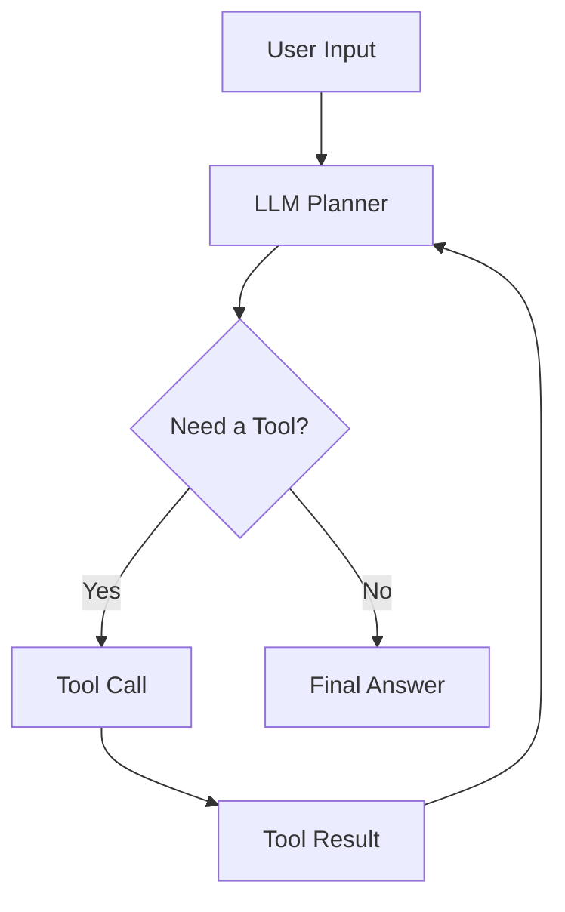
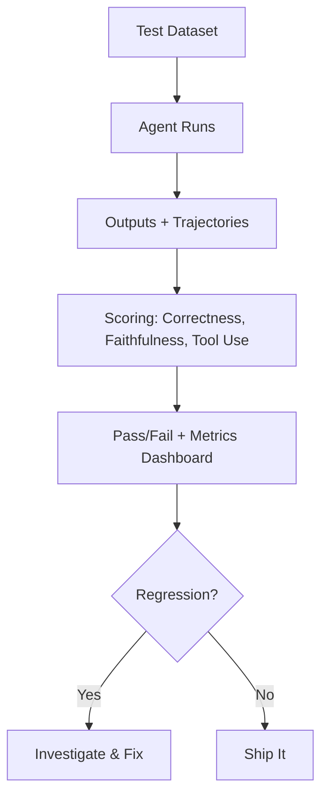
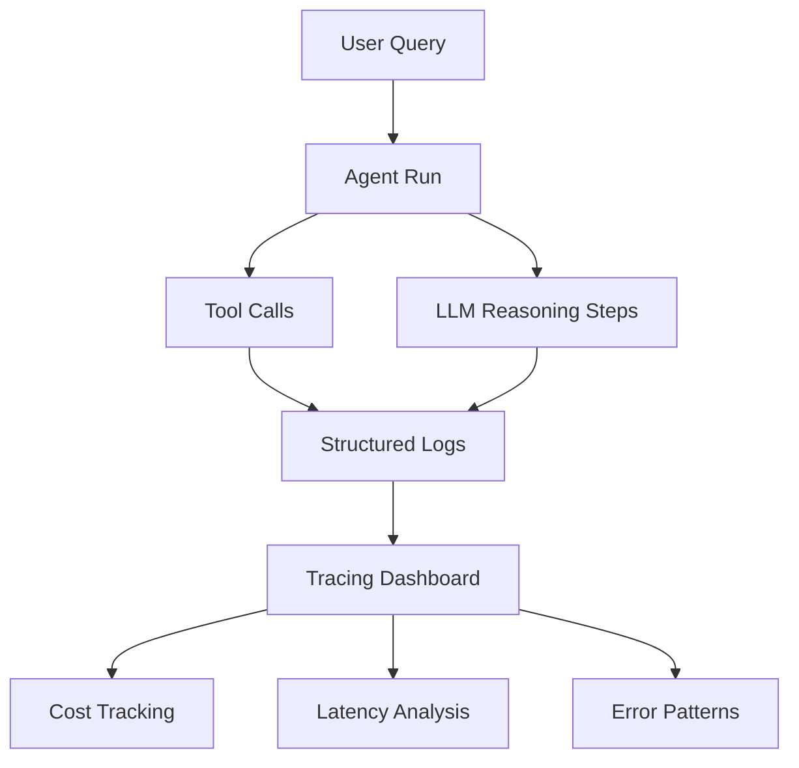
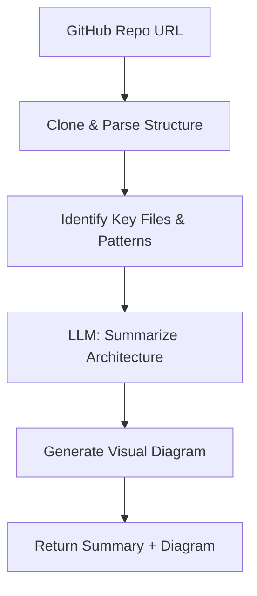

Recently I went to an AI conference and saw dozens of people demo their agents. Agents that could search the web, summarize documents, write code, book meetings, deploy to staging, you name it. The demos were impressive. But every time someone in the audience pushed back with a slightly unexpected question or asked the agent to chain two tasks together, things fell apart. Hallucinated tools. Made-up API arguments. Confident reports of success when nothing had actually happened.

These weren't hobbyists. These were solid engineers, people who know how to build reliable backend systems, design clean APIs, write thorough tests, and deploy with confidence. But the moment they started building agents, all of that discipline vanished. It was back to trial and error, vibes, and "let me tweak this prompt one more time."

Walking out of that conference, something crystallized for me:

> We don't have a tooling problem with agents. We have a **methodology** problem.

Because an agent is not magic. It's just an app where the control flow is partially owned by an LLM. And we already know how to build apps.

## The Core Parallel

If you've built backend systems, you already understand agents. You just don't realize it yet.

| Building Apps | Building Agents |
|----------|------------|
| Frontend / UI | User Input / Chat Interface |
| Backend Logic | LLM Reasoning |
| REST/GraphQL APIs | Tools (functions the LLM can call) |
| Database | Memory (short-term and long-term) |
| Event Loop / Request Lifecycle | Agent Loop |
| Logs & Monitoring | Traces & Evals |
| Error Handling & Retries | Guardrails & Fallbacks |

The mapping might not be perfect, but it's close enough to be useful. Every hard-won lesson from building distributed systems (separation of concerns, graceful degradation, observability, testing) applies directly to agents.

The problem is that most people treat agent-building as a fundamentally new discipline. It isn't. It's systems engineering with a non-deterministic component in the middle.

## Designing an Agent = Designing a System

When you start a new backend service, you don't jump straight into code. You ask: 
- What's the user goal?
- What are the flows?
- What APIs do we need?
- What can go wrong?

Same exact process applies here. You might have your own process and own set of questions depending on what and how you want to build, for whom, so on. But there'll be some design decisions that you need to take before you start building.

### 1. Goal clarity: single-shot vs multi-step

A single-shot agent takes a request and returns a response. Think: "Summarize this document." A multi-step agent plans, executes, observes, and iterates. Think: "Research this topic, find relevant papers, compare their findings, and write a report."

Most people jump straight to multi-step because it feels more impressive. But single-shot agents are easier to test, cheaper to run, and more predictable. Start there. Upgrade when you have evidence that you need more.

### 2. Control style: how much autonomy does the LLM get?

This is the architectural decision most people skip, and it's the one that matters most.

- **Reactive (ReAct)**: The LLM decides what to do at each step based on what it observes. Flexible, but hard to predict. Think of it like giving someone directions one turn at a time.
- **Plan-then-execute**: The LLM creates a plan upfront, then executes it step by step. More predictable, but brittle when the plan hits reality. Like writing out all the directions before the trip.
- **Hybrid**: Plan first, but allow re-planning when observations don't match expectations. This is where most production agents end up.

The [ReAct paper](https://arxiv.org/abs/2210.03629) by Yao and others formalized the reasoning + acting loop that most agent frameworks now implement. Worth reading if you want to understand the foundations.

### 3. Tool surface area: narrow vs wide

Every tool you give an agent is a degree of freedom. More tools means more capability, but also more ways to fail. A tool is essentially an API the LLM can call, and just like with microservices, the question isn't "can we add another endpoint?" but "should we?"

Start with 2-3 tools. Add more only when you can demonstrate the agent needs them. This isn't minimalism for aesthetics, it's minimalism for reliability.

## The Architecture Shift

In a traditional app:


You control every step. The flow is deterministic. If something breaks, you can trace exactly where.

In an agent system:


The key shift you'd notice by now is that in apps, you control the flow. In agents, you design the **boundaries** of control. You decide which tools exist, what they can do, how much context the LLM sees, and when to stop. The LLM decides everything else within those boundaries.

This is why agent design is closer to API design than to prompt engineering. You're defining an interface and a contract, not writing instructions.

## Building the Agent

In app development, the implementation phase is: pick your stack, wire your APIs, implement your logic. In agents, it's: pick your model, define your tools, define your loop.

### The Minimal Agent Loop

Every agent, regardless of framework, follows this pattern:



Here's what that looks like in practice with a simple Python implementation:

```python
import anthropic

client = anthropic.Anthropic()
tools = [
    {
        "name": "search_docs",
        "description": "Search internal documentation for relevant information",
        "input_schema": {
            "type": "object",
            "properties": {
                "query": {"type": "string", "description": "Search query"}
            },
            "required": ["query"]
        }
    }
]

def run_agent(user_message: str, max_steps: int = 10):
    messages = [{"role": "user", "content": user_message}]

    for step in range(max_steps):
        response = client.messages.create(
            model="claude-sonnet-4-6",
            max_tokens=1024,
            tools=tools,
            messages=messages
        )

        # If the model wants to use a tool
        if response.stop_reason == "tool_use":
            tool_block = next(b for b in response.content if b.type == "tool_use")
            tool_result = execute_tool(tool_block.name, tool_block.input)

            messages.append({"role": "assistant", "content": response.content})
            messages.append({
                "role": "user",
                "content": [{
                    "type": "tool_result",
                    "tool_use_id": tool_block.id,
                    "content": tool_result
                }]
            })
        else:
            # Model is done, return the final response
            return response.content[0].text

    return "Agent reached maximum steps without completing."
```

That's it. That's a working agent. No framework, no abstractions. Just a loop that lets an LLM call tools and reason about results.

### Start Small, Then Expand

> Most people overbuild agents.

I've seen teams start with 15 tools, a vector database for memory, a planning module, a reflection step, and a custom evaluation pipeline, all before they've validated that the agent can reliably do the one thing it's supposed to do.

Start with:
- 1 model
- 2-3 tools
- No memory

Get that working reliably. Then add complexity one piece at a time, measuring the impact of each addition. This is the same advice we give for microservices: start with a monolith, extract services when you have a reason to.

### Skills: The Building Blocks

As your agent grows beyond a few tools, you'll notice something. The interesting behavior isn't in the agent loop itself, it's in the capabilities the agent calls. Searching, summarizing, classifying, extracting, judging. These are **skills**, the smallest units of intelligence that actually produce outcomes.

Most teams embed skills directly into prompts or tool wrappers, tightly coupled to a specific agent. That works early on, but it doesn't scale. When a skill is buried inside a prompt, you can't test it in isolation, you can't reuse it across agents, and you can't improve it without risking regressions elsewhere.

The better approach is to treat skills as first-class artifacts. A skill has a clear interface, it can run independently, and its behavior can be measured. Think of it like the difference between inline code and a well-defined function with a contract. The agent decides *what* to do. The skill defines *how* it gets done.

This separation pays off quickly. Agents become simpler because they're just orchestration. Debugging gets easier because you can isolate which skill misbehaved. And reuse becomes real, not just theoretical. A summarization skill that works for your research agent can plug into your customer support agent without rewriting anything.

[Anthropic's agent skills framework](https://www.anthropic.com/engineering/equipping-agents-for-the-real-world-with-agent-skills) formalizes this idea, treating skills as discoverable, composable units rather than implicit prompt logic. I've been building on this with [Sutras](/skills-agents-and-sutras/), a CLI that handles the lifecycle around skills: authoring, validation, evaluation, versioning, and distribution. Because having a spec for what a skill is doesn't help much if you can't test it, version it, or share it.

If you're building agents that need to do more than one or two things well, start thinking in skills early. It'll save you from the "giant prompt that does everything" trap.

### Frameworks and When to Use Them

If you're building something simple, you probably don't need a framework. The code above is ~30 lines. But as complexity grows, frameworks help with orchestration, state management, and tool registration.

Some worth knowing:

- [LangGraph](https://github.com/langchain-ai/langgraph): Graph-based agent orchestration from LangChain. Good for complex multi-step workflows where you need explicit control over the execution graph.
- [CrewAI](https://github.com/crewAIInc/crewAI): Multi-agent collaboration framework. Useful when your problem naturally decomposes into roles (researcher, writer, reviewer).
- [Anthropic's Agent SDK](https://github.com/anthropics/anthropic-sdk-python): Lightweight, close-to-the-metal. Good when you want control without too much abstraction.
- [Autogen](https://github.com/microsoft/autogen): Microsoft's multi-agent framework. Strong on conversation patterns between agents.

The right choice depends on your use case, not on what's trending on Linkedin or X(Twitter). A single-agent tool-use loop doesn't need LangGraph. A multi-agent research pipeline probably does.

## Testing Agents: The Missing Discipline

This is where the gap between "app thinking" and "agent thinking" is widest.

In app development, we have decades of established practice: unit tests, integration tests, end-to-end tests, staging environments, CI/CD pipelines. In the agent world? Mostly vibes. Someone runs the agent a few times, eyeballs the output, and calls it good.

That's not engineering. That's a demo.

### The Agent Testing Stack

| Agent Testing | App Equivalent | What It Catches |
| --- | --- | --- |
| Tool unit tests | Unit tests | Broken tools, bad schemas |
| Single-step evals | Function tests | Wrong tool selection, bad arguments |
| Multi-step trajectory evals | Integration tests | Planning failures, loops, dead ends |
| Prompt injection tests | Security testing | Adversarial manipulation |
| Eval datasets with scoring | Regression testing | Quality degradation over time |

I've written about [evals](/ai-evals/) and [building trustworthy AI tools](/building-ai-tools-you-can-trust/) before, and everything in those posts applies here. But agents add a new dimension: you're not just evaluating a single output, you're evaluating a **trajectory**, the sequence of decisions the agent made to get there.

### Evaluating Trajectories, Not Just Outputs

A wrong answer that came from a reasonable chain of reasoning is very different from a right answer that came from lucky hallucination. You need to evaluate both.

```python
from ragas.metrics.collections import Faithfulness
from ragas.llms import llm_factory

# Works with any supported model: gpt-4o-mini, claude-sonnet, gemini-pro, etc.
llm = llm_factory("gpt-4o-mini")
faithfulness = Faithfulness(llm=llm)

# Evaluate whether the agent's final answer is grounded in what its tools returned
result = await faithfulness.ascore(
    user_input="What were our Q4 sales?",
    response=agent_final_answer,
    retrieved_contexts=tool_results_from_agent_run
)
print(f"Score: {result.value}")   # e.g. 0.85
print(f"Reason: {result.reason}") # explanation of the score
```

The `MetricResult` object gives you both a score and a reason, so you know not just *how faithful* the answer is but *why* it scored that way. This tells you whether the agent's answer is grounded in the information it actually retrieved, not whether it sounds plausible.

### The Eval Mindset



> If you're not running evals, you don't have an agent. You have a demo.

I keep coming back to this because it's the single biggest gap I see. Teams spend weeks building agent capabilities and zero hours building agent evals. Then they're surprised when the agent breaks in production.

If you need help getting started with evals, [Ragas](https://ragas.io/) is a solid starting point. For more on the philosophy, the [Anthropic guide to evaluations](https://docs.anthropic.com/en/docs/build-with-claude/develop-tests) is excellent.

## Running Agents

Traditional apps follow a clean request/response cycle. A request comes in, business logic runs, a response goes out. Stateless, predictable, well-understood.

Agents break this model in several ways:

- *They loop.* An agent might make 3 tool calls or 30, depending on the task.
- *They're stateful.* Context accumulates across steps within a single run.
- *They're slow.* A multi-step agent might take 30 seconds or 3 minutes to complete.
- *They're expensive.* Each step consumes tokens, and tokens cost money.

### Runtime Patterns

**Short-lived agents**: Synchronous, request/response. The user waits. Good for simple tool-use (under 10 seconds). This is your starting point.

**Long-running agents**: Async, queue-based. The user submits a task and checks back later. Necessary when the agent might run for minutes. Think: research tasks, code generation with testing, data analysis pipelines.

**Streaming agents**: Partial outputs as the agent works. The user sees progress. Good for chat interfaces where you want to show the agent's reasoning in real-time. Most modern APIs (Claude, GPT, Gemini, Mistral, GLM) support streaming natively.

### Failure Modes You Must Handle

This is where agent systems diverge sharply from traditional apps. In a normal API, if a request fails, you return a 500 and the client retries. In an agent, failures are more insidious:

- **Tool failures**: An API is down, a database query times out. The agent needs to know how to handle this gracefully: retry, skip, or ask the user.
- **Hallucinated tool arguments**: The LLM invents parameters that don't exist or passes the wrong types. This is the agent equivalent of a type error, except your type system is a prompt.
- **Infinite loops**: The agent keeps calling the same tool with the same arguments, expecting different results. Without a step limit, you burn through tokens and patience.
- **Context window overflow**: In long-running agents, the conversation history grows until it exceeds the model's context window. You need a strategy for summarizing or truncating.

Handling these isn't optional. It's the difference between a demo and a product.

```python
def run_agent_with_guardrails(user_message: str):
    max_steps = 15
    max_consecutive_errors = 3
    error_count = 0

    messages = [{"role": "user", "content": user_message}]

    for step in range(max_steps):
        try:
            response = client.messages.create(
                model="claude-sonnet-4-6",
                max_tokens=1024,
                tools=tools,
                messages=messages
            )
            error_count = 0  # Reset on success

            if response.stop_reason == "tool_use":
                tool_block = next(b for b in response.content if b.type == "tool_use")
                try:
                    result = execute_tool(tool_block.name, tool_block.input)
                except ToolExecutionError as e:
                    result = f"Tool error: {e}. Try a different approach."

                messages.append({"role": "assistant", "content": response.content})
                messages.append({
                    "role": "user",
                    "content": [{"type": "tool_result", "tool_use_id": tool_block.id, "content": result}]
                })
            else:
                return response.content[0].text

        except Exception as e:
            error_count += 1
            if error_count >= max_consecutive_errors:
                return f"Agent stopped after {max_consecutive_errors} consecutive errors: {e}"

    return "Agent reached step limit. Partial progress may be available."
```

## Making It Real

Deploying an agent is deploying a backend service, plus extra concerns unique to LLM-based systems.

### Cost

Every agent step is an API call. Every API call costs tokens. A multi-step agent that makes 10 tool calls per request can easily cost 10-50x more than a single LLM call. You need to budget for this.

Practical strategies:
- Use cheaper models (Claude Haiku, GPT-4o-mini, Gemini Flash, Qwen-turbo) for simple steps, expensive models (Claude Opus, GPT-4, Gemini Pro, Mistral Large) for complex reasoning.
- Cache tool results aggressively. If two users ask about the same data, don't re-fetch.
- Set hard token budgets per agent run.

### Latency

Multi-step agents are inherently slow. Each step requires a round-trip to the model API. A 5-step agent with 2-second API latency takes at minimum 10 seconds.

Strategies:
- Parallelize independent tool calls where possible.
- Stream partial outputs so the user sees progress.
- Set user expectations. A loading spinner that says "Researching..." is better than a blank screen for 30 seconds.

### Observability

This is where [traces](https://docs.anthropic.com/en/docs/build-with-claude/prompt-caching) become critical. Logs tell you *what* happened. Traces tell you *why*.

For every agent run, you want to capture:
- The user's original request
- Each LLM call (input, output, model, latency, token usage)
- Each tool call (name, arguments, result, duration)
- The final output
- Total cost and duration



Tools like [Langfuse](https://langfuse.com/), [Braintrust](https://braintrustdata.com/), and [Arize Phoenix](https://phoenix.arize.com/) are purpose-built for this. If you're already using Datadog or Grafana, you can pipe agent traces there too.

## Memory: The State Management Problem

Memory in agents maps directly to state management in apps. And just like in apps, getting it wrong leads to subtle, hard-to-debug issues.

**Short-term memory** is the conversation history within a single agent run. This is your working context. Every message, tool call, and result accumulates here. The challenge is context window management, since you can't keep everything forever.

**Long-term memory** is persistent state across runs. User preferences, past interactions, learned facts. This is your database. The challenge is retrieval: how does the agent know what's relevant from thousands of past interactions?

Most agents don't need long-term memory at first. Start without it. Add it when users complain that the agent "forgets" important context.

If you do need memory, vector databases (Pinecone, Weaviate, Qdrant) are the standard approach for semantic retrieval. But don't underestimate simpler approaches. A SQLite database with structured metadata can go surprisingly far.

### Context Management

Context is the single most important resource an agent has. Every decision the LLM makes is based on what's in its context window. Feed it too little and it makes uninformed choices. Feed it too much and it drowns in noise, misses key details, or hits token limits mid-run. For a multi-step agent that accumulates tool calls and results over 10-15 steps, context bloat isn't a theoretical risk, it's the default outcome.

This matters more for agents than for simple chat applications. In a chatbot, a bad context window means a slightly off response. In an agent, it means the wrong tool gets called, the wrong arguments get passed, and the entire trajectory goes sideways. The LLM's ability to plan and reason degrades as context fills up with irrelevant information.

#### Sliding window
Keep only the last N messages or tokens. Simple and predictable, but you lose early context that might still be relevant. Works well for short-lived agents where early steps don't inform later ones.

#### Summarization
Periodically compress older messages into a summary and replace them. The agent retains the gist without carrying the full weight. This is the most common pattern for long-running agents. The tradeoff is that summarization itself costs tokens and can lose nuance.

#### Selective injection
Don't carry everything forward. Instead, store tool results and past reasoning externally, then use RAG to pull in only what's relevant for the current step. This is the most scalable approach but adds retrieval latency and complexity.

#### Structured context
Instead of dumping raw tool outputs into the conversation, format them into concise structured summaries before adding them to context. A 500-line API response becomes a 10-line summary of the fields that matter. This is cheap to implement and often the highest-impact optimization.

As your agent handles longer tasks or serves more users concurrently, context management becomes a scaling bottleneck. Each agent run holds its own context in memory. Longer contexts mean more tokens per API call, which means higher cost and latency. At scale, the practical strategies are: keep individual agent runs short and focused, break complex tasks into sub-agents with their own scoped context, and invest in good summarization so context stays lean. The agents that scale well aren't the ones with the biggest context windows, they're the ones that are smartest about what goes into the window in the first place.

## Distribution

This is where agents and traditional apps truly diverge.

Apps distribute through well-understood channels: App Store, web, desktop. Agents have more options, and the right distribution model fundamentally shapes how you build.

- **API-first agents**: Your agent is a service that other developers integrate. Think: a code review agent that plugs into GitHub via webhooks.
- **Chat/UI agents**: Embedded in a conversational interface. The most common pattern today.
- **CLI agents**: For developer tools and power users. [Claude Code](https://docs.anthropic.com/en/docs/claude-code/overview) is a good example, a full agent that lives in the terminal.
- **Embedded agents**: Inside existing products, triggered by user actions. Not a standalone "AI feature" but intelligence woven into the product flow.

And then there's composability. With protocols like [Model Context Protocol (MCP)](https://modelcontextprotocol.io/), agents can discover and use tools dynamically. This shifts distribution from "ship a complete agent" to "ship capabilities that any agent can use." I've been [building skills as composable units](/skills-agents-and-sutras/) for exactly this reason. The future isn't monolithic agents, it's an ecosystem of interoperable capabilities.

> The best agent doesn't win. The most **accessible** agent does.

This is true for apps and doubly true for agents. An agent that's 80% as capable but available inside the tool your users already live in will beat a 100% capable agent that requires switching contexts.

## Putting It All Together

Let's trace through a real example. Say you're building an agent that helps developers understand unfamiliar codebases. Given a GitHub repo URL, it parses the structure, identifies key patterns, and produces a visual summary.

### Design Phase

- **Goal**: Single repo → structured explanation with visual
- **Control style**: Plan-then-execute (the steps are predictable)
- **Tools**: repo cloner, file reader, code summarizer, diagram generator
- **Memory**: None needed (each request is independent)

### Implementation



### Testing

- **Tool tests**: Does the repo cloner handle private repos? Large repos? Monorepos?
- **Single-step evals**: Given a known repo, does the summarizer identify the right architectural patterns?
- **End-to-end evals**: For 50 popular open-source repos, are the summaries accurate and the diagrams useful?
- **Prompt injection**: What if the repo's README contains instructions to the LLM?

### Where People Mess Up

- **No evals** → inconsistent outputs that they don't notice until users complain
- **Too many tools** → the LLM gets confused about which to use, or invents parameters
- **No constraints** → the agent tries to read every file in a 10,000-file monorepo
- **No cost limits** → a single request triggers hundreds of LLM calls parsing files

Every one of these is preventable with the same engineering discipline we apply to regular apps.

## Takeaways

If you take one thing from this post, let it be this: **agents are not a new paradigm. They're a new runtime for the same engineering principles we've always used.**

- Design agents like systems, not like prompts
- Most agent failures are design failures, not model failures
- Testing and evals are the biggest missing piece. [Invest in them early](/ai-evals/).
- Start simple: 1 model, 2-3 tools, no memory. Expand with evidence.
- Observability isn't optional. You need to know what your agent did and why.
- Distribution and accessibility will decide winners, not raw capability

> We don't need better prompts. We need better **systems thinking** for agents.

_The playbook already exists. We just need to open it._

## References & Further Reading

- [ReAct: Synergizing Reasoning and Acting in Language Models](https://arxiv.org/abs/2210.03629), the foundational paper on the reason-then-act loop
- [Anthropic: Building Effective Agents](https://www.anthropic.com/engineering/building-effective-agents), practical patterns from Anthropic's research
- [Anthropic: Guide to Evaluations](https://docs.anthropic.com/en/docs/build-with-claude/develop-tests), how to test LLM-based systems properly
- [Model Context Protocol](https://modelcontextprotocol.io/), open standard for connecting LLMs to tools and data
- [LangGraph Documentation](https://langchain-ai.github.io/langgraph/), graph-based agent orchestration
- [Ragas](https://ragas.io/), evaluation framework for LLM applications
- [Langfuse](https://langfuse.com/), open-source observability for LLM apps
- [Lilian Weng: LLM Powered Autonomous Agents](https://lilianweng.github.io/posts/2023-06-23-agent/), one of the best technical overviews of agent architectures
- [The Landscape of Emerging AI Agent Architectures](https://arxiv.org/abs/2409.02977), survey of agent design patterns
